# MangaLighter - Plateforme e-commerce de mangas

**Auteur** : Salwa Elghailani  
**Master** : DevOps et Cloud Computing  
**Année Universitaire** : 2024/2025  
**Encadré par** : Pr. KOUISSI Mohamed  
**Établissement** : Faculté Polydisciplinaire de Larache, Maroc  

---

## Table des matières
1. [Introduction](#introduction)
2. [Technologies utilisées](#technologies-utilisées)
3. [Architecture du projet](#architecture-du-projet)
4. [Fonctionnalités implémentées](#fonctionnalités-implémentées)
5. [Perspectives](#perspectives)
6. [Guide d'installation](#guide-dinstallation)


---

## Introduction

MangaLighter est une application web e-commerce spécialisée dans la vente de mangas physiques. Développée avec Angular, elle offre aux passionnés de mangas une plateforme intuitive pour découvrir, sélectionner et commander leurs œuvres favorites.

Principaux objectifs :
- Digitaliser l'expérience d'achat de mangas
- Simplifier la gestion des commandes
- Garantir la confidentialité des données utilisateurs
- Offrir une interface utilisateur optimisée

---

## Technologies utilisées

### Frontend
- **Angular 19** : Framework frontend modulaire
- **TypeScript** : Typage statique pour une meilleure robustesse
- **HTML5/CSS3** : Structure et style de l'interface
- **RxJS** : Gestion des flux de données asynchrones

### Backend (simulé)
- **JSON** : Stockage des données (produits, utilisateurs, commandes)
- **Node.js/Express** : API REST légère pour la gestion des données

### Outils
- **Angular CLI** : Génération de code et gestion du projet
- **Git** : Versionning du code source

---

## Architecture du projet
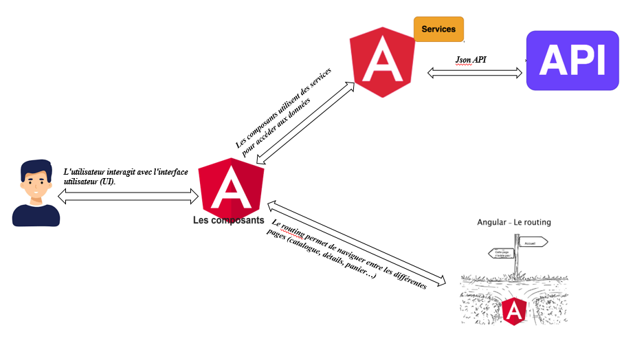

## Principaux composants :
- `CatalogComponent` : Affichage et filtrage des produits
- `ProductDetailsComponent` : Fiche détaillée d'un manga
- `CartComponent` : Gestion du panier
- `CommendeComponent` : Saisie des informations personnelles et confirmation finale de la commande.
- `MesCommandesComponent` :Affichage de l’historique des commandes d’un utilisateur connecté.
- `SigninComponent` :Formulaire de connexion utilisateur.
- `SignupComponent` : Formulaire d’inscription d’un nouvel utilisateur.
---
## Services :
- `AuthService` : Gestion de l'authentification
- `cardService` :Gère les opérations liées au panier (ajout, suppression, totalisation).
- `CommandeService` :Envoie les commandes vers l’API, récupération de l’historique, annulation de
- `ProductService` :Fournit les données des mangas (depuis un mock ou une API).
- `SharedDataService` :Partage de données entre composants (ex : données du panier, utilisateur
- `UserService` :Gère les opérations liées aux utilisateurs (profil, commandes associées, etc.).
---

## Modèles :
 - `Product`: Interface ou classe définissant les propriétés d'un produit (id, nom, prix, quantité, etc.).
 - `user`: Représente un utilisateur avec : id, nom, email, motDePasse, adresse, téléphone, etc.
---
## Fonctionnalités implémentées

## Catalogue interactif
L'interface épurée présente les mangas phares comme "Attack on Titan" et "Death Note" sous forme de cartes visuelles avec prix et indicateur de stock. La barre de recherche centrale et le filtre par genres (Action, Fantaisie...) permettent une navigation intuitive.
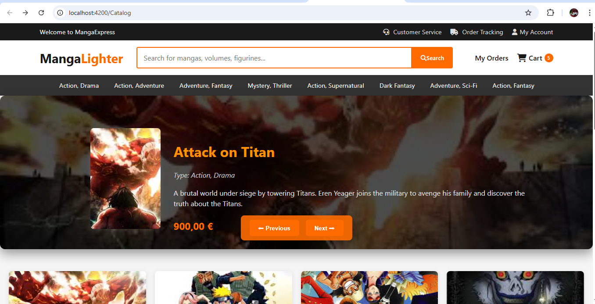
---
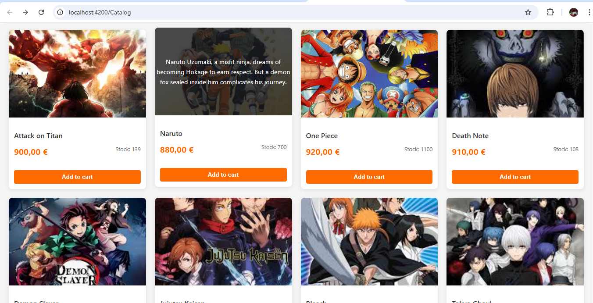

### Fiche Produit
Page de détail complète avec image haute résolution, synopsis détaillé, informations techniques (genre, prix) et indicateur de stock coloré (rouge si <10 unités).
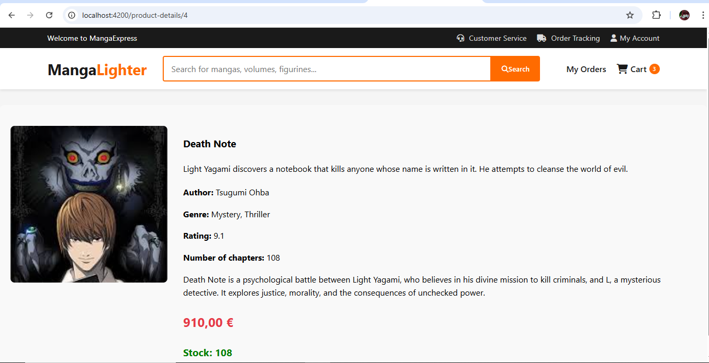
---
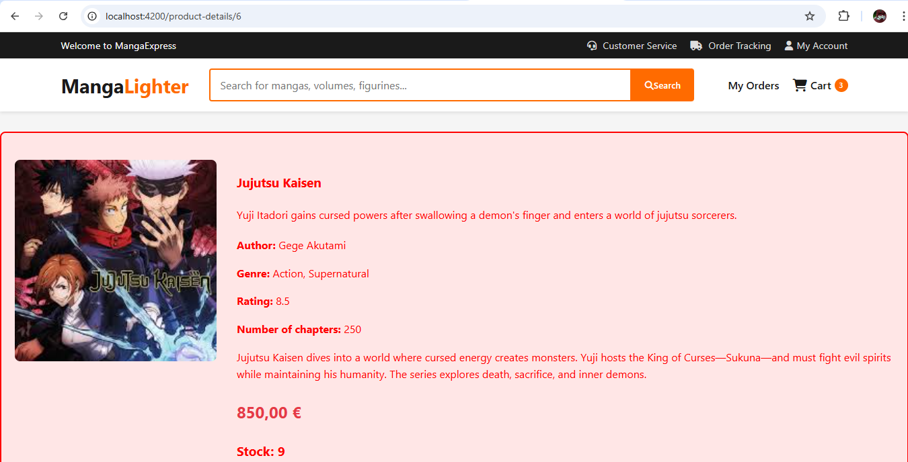
### Recherche Dynamique 
Fonctionnalité de recherche en temps réel permettant de filtrer les mangas par titre ou caractéristiques, avec résultats instantanés.
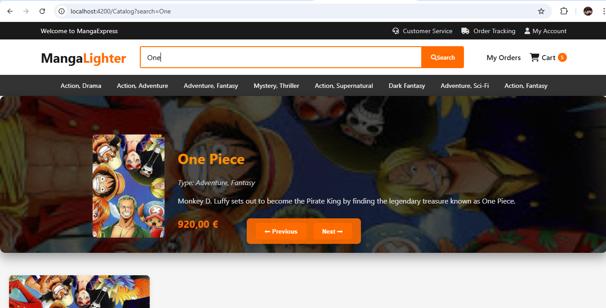

### Filtres par Genre 
Système de filtrage multicritère organisé par tags (Action, Drame, Mystère...) pour une exploration thématique des collections.
- Affichage des produits avec filtrage (genre, disponibilité)
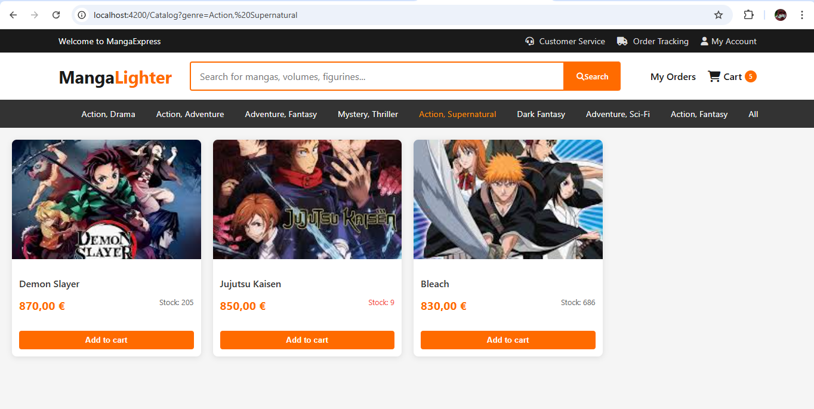

## Gestion Utilisateur
### Connexion 
Formulaire minimaliste avec validation des champs (email/mot de passe) et gestion des erreurs, incluant un lien vers l'inscription.
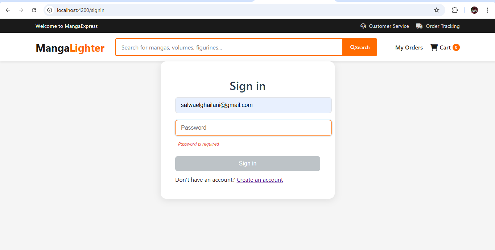
### Messages d'Erreur 
Feedback utilisateur clair pour les erreurs de connexion (identifiants invalides, champs requis), avec indication visuelle des champs problématiques.

### Inscription 
Processus d'enregistrement sécurisé avec validation en temps réel des données saisies (format email, complexité du mot de passe).
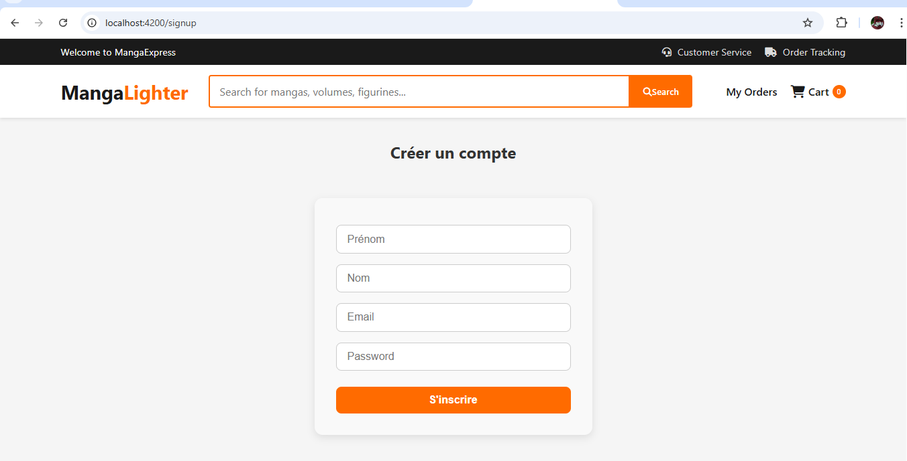
### Déconnection
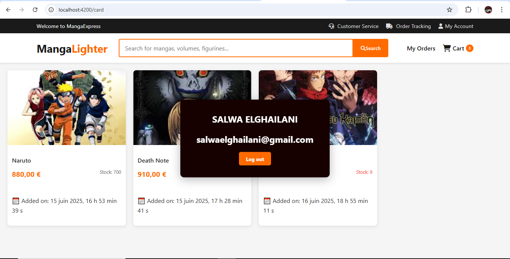

## Processus d'Achat

### Panier 
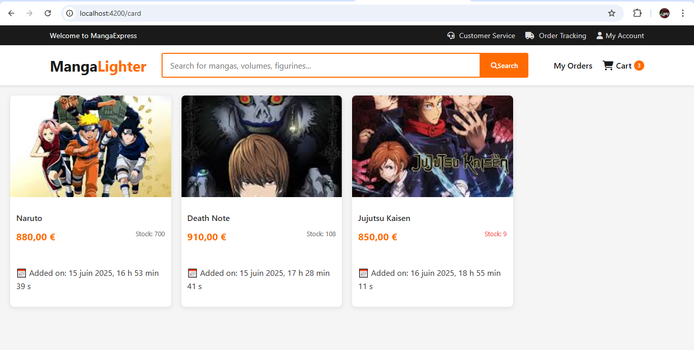
Interface interactive permettant :
- La sélection/désélection par double-clic
- 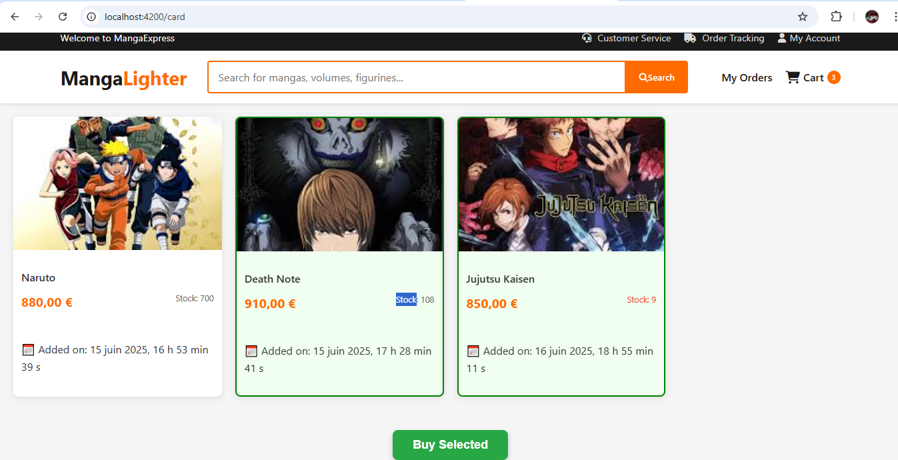
- Visualisation des articles choisis
- Calcul automatique du montant total
- Bouton de validation vers la commande

### Finalisation Commande 
Formulaire de livraison avec :
- Récapitulatif des produits
- Saisie des coordonnées (adresse, téléphone)
- Validation sécurisée

### Historique 
Tableau chronologique des commandes avec :
- Statut (en attente/validé)
- Détails des achats
- Option d'annulation
- Panier modifiable avec sélection multiple
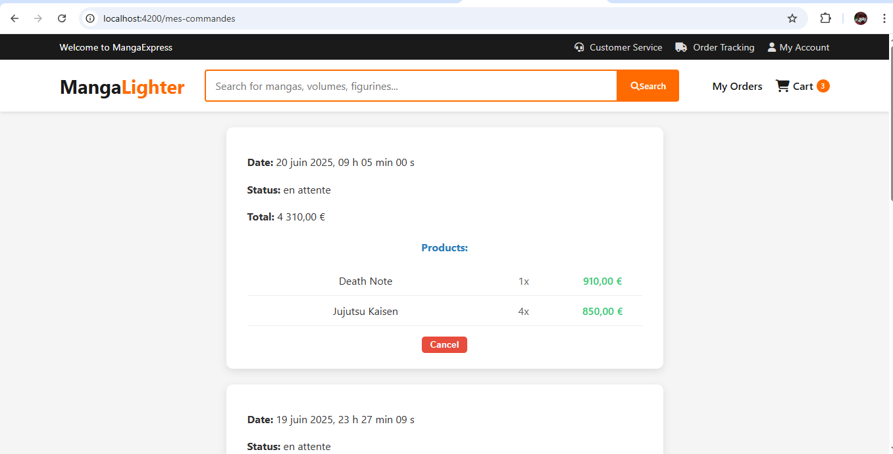


## Guide d'installation

### Notes Supplémentaires :
Code Propre : Respect des conventions Angular (components/services séparés, utilisation de async pour les données).

Test : Vérifié avec "ng test" et "ng lint".

Dépendances : Aucune dépendance externe supplémentaire requise.

### Prérequis
- Node.js v18+
- Angular CLI v19+

### Development server

To start a local development server, run:

```bash
ng serve
```

Once the server is running, open your browser and navigate to `http://localhost:4200/`. The application will automatically reload whenever you modify any of the source files.

### Code scaffolding

Angular CLI includes powerful code scaffolding tools. To generate a new component, run:

```bash
ng generate component component-name
```

For a complete list of available schematics (such as `components`, `directives`, or `pipes`), run:

```bash
ng generate --help
```

### Building

To build the project run:

```bash
ng build
```

This will compile your project and store the build artifacts in the `dist/` directory. By default, the production build optimizes your application for performance and speed.

### Running unit tests

To execute unit tests with the [Karma](https://karma-runner.github.io) test runner, use the following command:

```bash
ng test
```

### Running end-to-end tests

For end-to-end (e2e) testing, run:

```bash
ng e2e
```

Angular CLI does not come with an end-to-end testing framework by default. You can choose one that suits your needs.

### Additional Resources

For more information on using the Angular CLI, including detailed command references, visit the [Angular CLI Overview and Command Reference](https://angular.dev/tools/cli) page.
